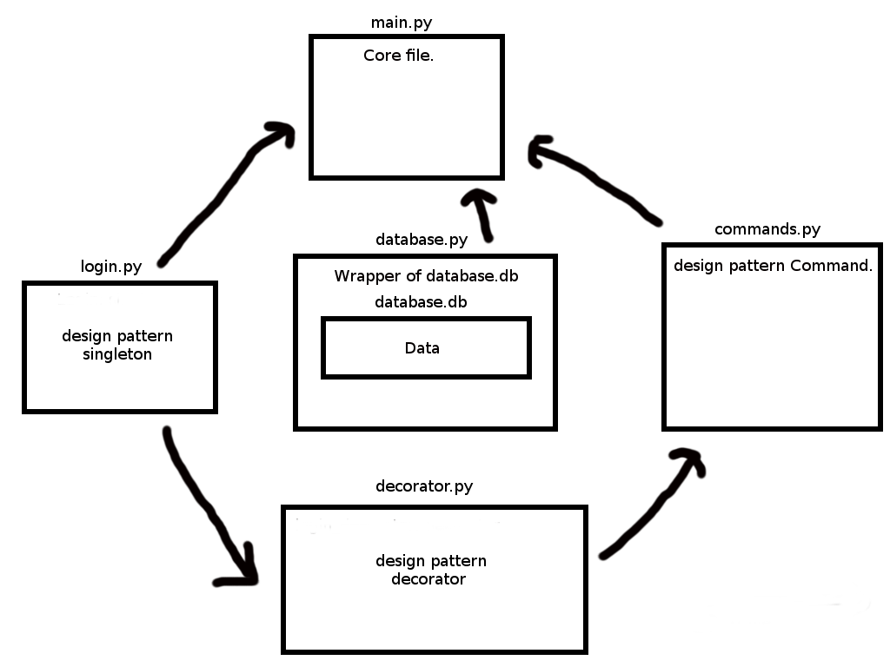

# Principy tvorby softveru
Prva domaca uloha.

Uloha sa zklada z nasledujucich suborov:
* main.py
* commands.py
* decorator.py
* login.py
* database.py
* database.db

Struktura programu:




### main.py
Toto je spustitelny subor, ktory loaduje moduly a parsuje vstup a podla toho vola Command triedy s parametramy.
Predtym vsak vytvory objekt login, kde si poprosi zadavacie heslo.


### commands.py
Module, ktory obsahuje jednoduchy navrhovy vzor command.
Abstraktna trieda zaobaluje referenciu na databazu z modulu ```database.py```. 
Obsahuje este triedu CommandHistory, ktora niakoniec vykonava Command objekt, ktory dostane a ulozi ho do historie


### decorator.py
Modul, ktory obsahuje jedniny triedu **login_decorator**. Pomocou tejto triedy dekorujeme triedy z ```commands.py```, ktore pri ich vykonani maju vypytat heslo. 


### login.py
Modul, ktory obsahuje triedy Login, ktora je typu singleton.
Dovod, je taky, ze pri jej inicializacii v ```main.py``` sa nastavy heslo, ktore chceme nastavit len raz.
Trieda Login sa vytvara v kazdom dekoratore, co bys sposobilo, ze pri kazdom novom prikaze, by sa vytvaralo nove heslo.


### database.py
Jednoducha trieda, ktora obaluje databazu ```database.db```.
Vyuziva modul [**sqlite3**](https://docs.python.org/3/library/sqlite3.html).

### database.db
Subor, ktory obsahuje samostatnu databazu.
